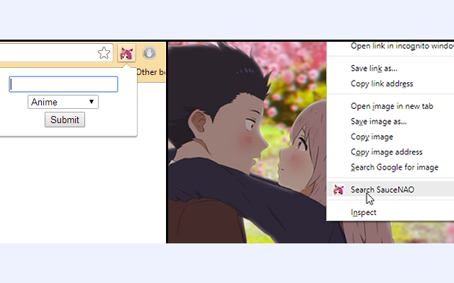
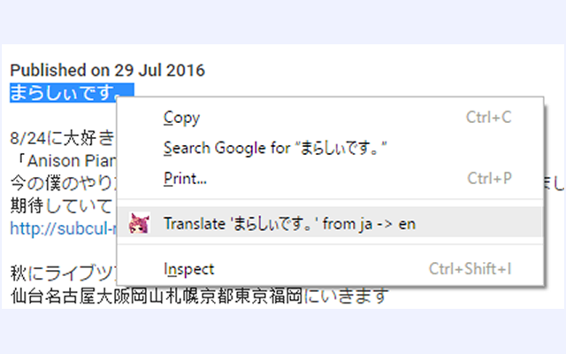
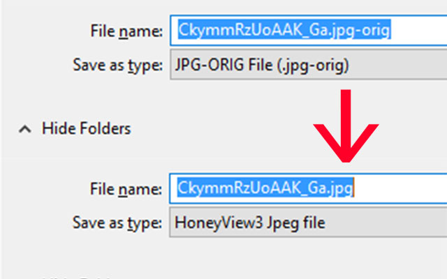
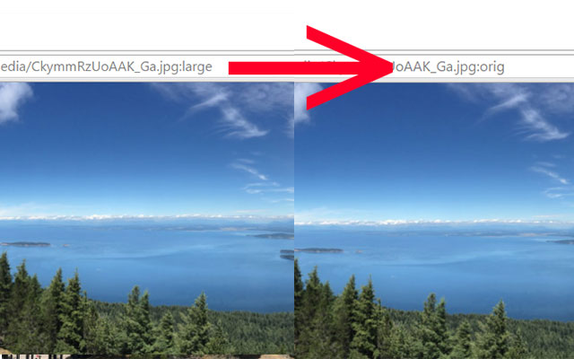

Lemon-X-Chrome-Extension
========================
Chrome extension built for educational purposes and personal use.  
Get it here: <https://chrome.google.com/webstore/detail/lemon-x/chdldhicokpngnfcmbgmgleipomcojfi>

Features
------------
Adds context menu for images
- Reverse image search with SauceNAO

Adds context menu for highlighted text
- Translate selected text from Japanese to English with Google Translate

Adds toolbar button
- Quickly search MyAnimeList
 
Redirects Twitter image URLs to the original size and quality version

Download Twitter images as image files instead of Twitter's jpg-large files

To install
------------
Visit this page and click "ADD TO CHROME" in the top right corner:  
<https://chrome.google.com/webstore/detail/lemon-x/chdldhicokpngnfcmbgmgleipomcojfi>

To install (manual)
------------
1. Download the file found on the [Release](https://github.com/Teh-Lemon/Lemon-X-Chrome-Extension/releases) page.
2. Extract the contents of the .zip file somewhere permanent
3. Open up the extensions page in Google Chrome (Menu -> Tools -> Extensions).
4. Turn on Developer Mode in the top right corner
5. Click "Load unpacked extension" in the Chrome Extensions page at the top
6. Point it to the files you just extracted

To update:   

1. Overwrite the files of the extension with the new files  
2. If the directory is not changed, Chrome will automatically detect and install the update

Permissions
-----------------
Read and change your data on pbs.twimg.com
- Used to redirect Twitter images to the original size  

Screenshots
-----------------
  
  
  
  
